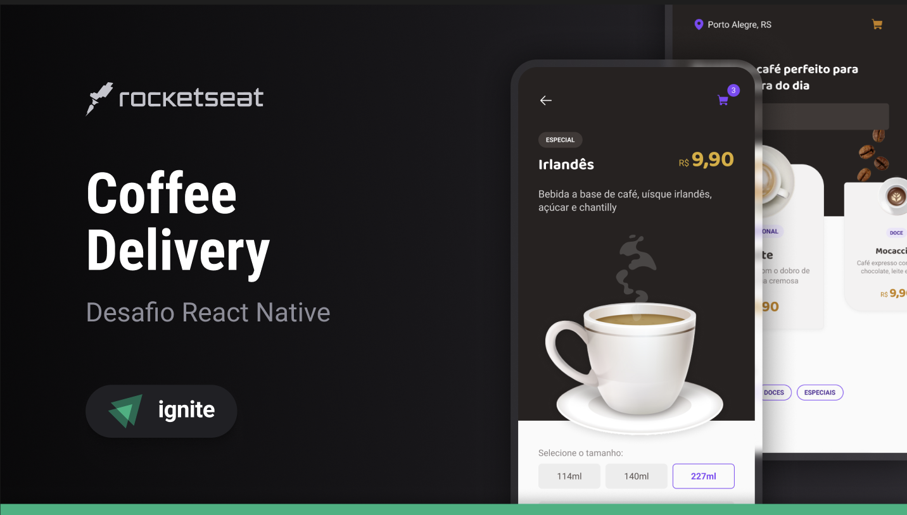

<h4 align="center">
  Ignite Coffee Delivery is a simple mobile project for sell coffee
</h4>

  

## 🚀 Technologies

This project was developed using the following technologies:

- [expo](https://docs.expo.dev/)
- [react native](https://reactnative.dev/)
- [native base](https://nativebase.io/)
- [typescript](https://www.typescriptlang.org/)
- [VS Code][vscode] with [EditorConfig][vceditconfig] and [ESLint][vceslint]
---

Made with ♥ by Matheus Antonio 🌊 [Get in touch!](https://www.linkedin.com/in/matheus-antonio-us/)

[vscode]: https://code.visualstudio.com/
[vceditconfig]: https://marketplace.visualstudio.com/items?itemName=EditorConfig.EditorConfig
[vceslint]: https://marketplace.visualstudio.com/items?itemName=dbaeumer.vscode-eslint
